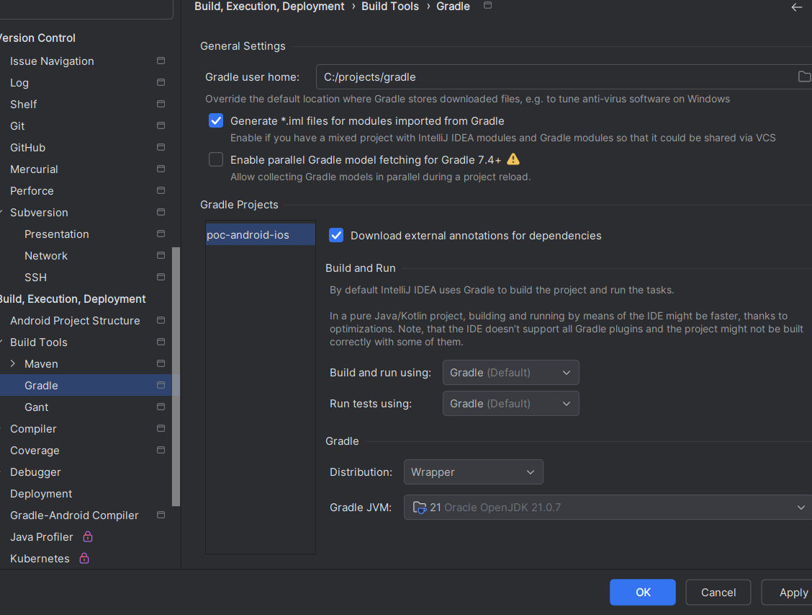
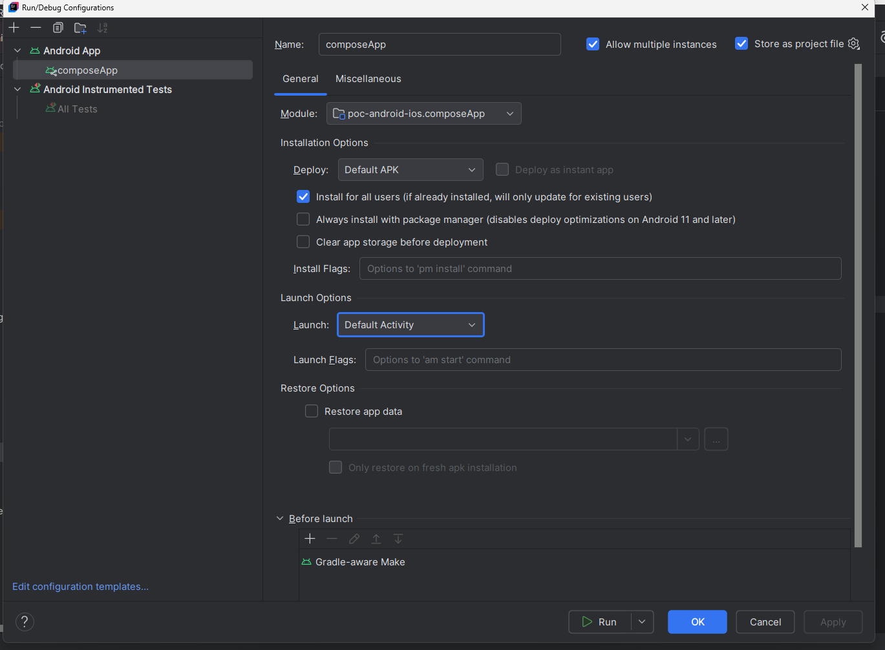

#### Curso Completo de Kotlin Multiplatform: Desarrolla Apps para Android y iOS
- https://www.youtube.com/watch?v=F0AWKPSDbHo&t=2590s

- crear proyecto según tipologia:
  - [Kotlin Multiplatform Wizard](https://kmp.jetbrains.com/?android=true&ios=true&iosui=compose&includeTests=true) 

- JAVA_HOME=C:\programs\jdk\jdk-24\bin
- ANDROID_HOME=C:\programs\android\sdks
- path: C:\programs\android\cmdline-tools\bin
  - https://dl.google.com/android/repository/commandlinetools-win-13114758_latest.zip?hl=es-419 
- Para graddle es mejor usar el jdk21
- 
- 